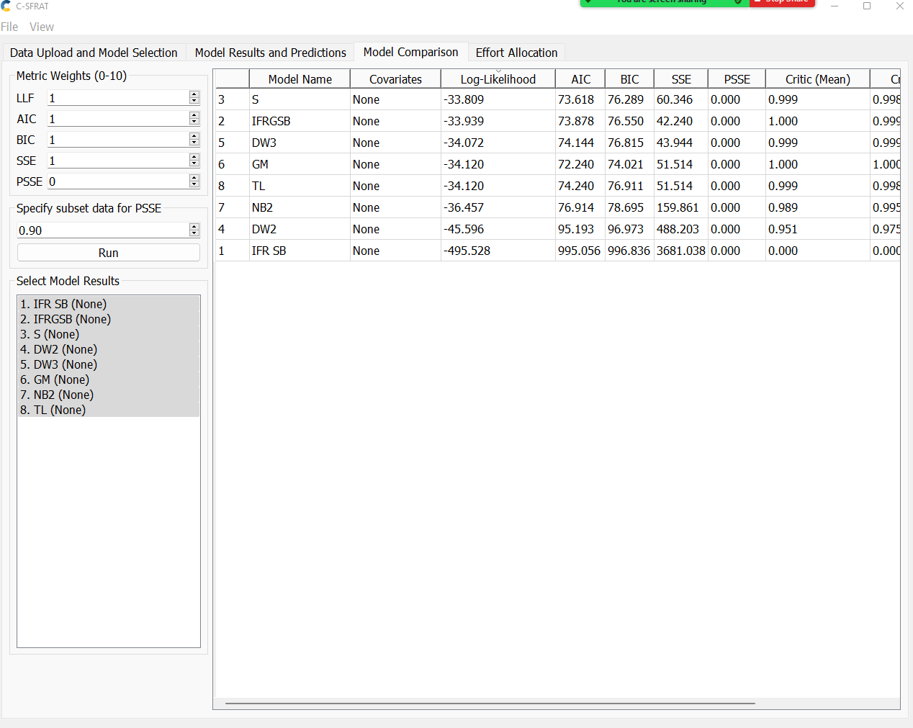
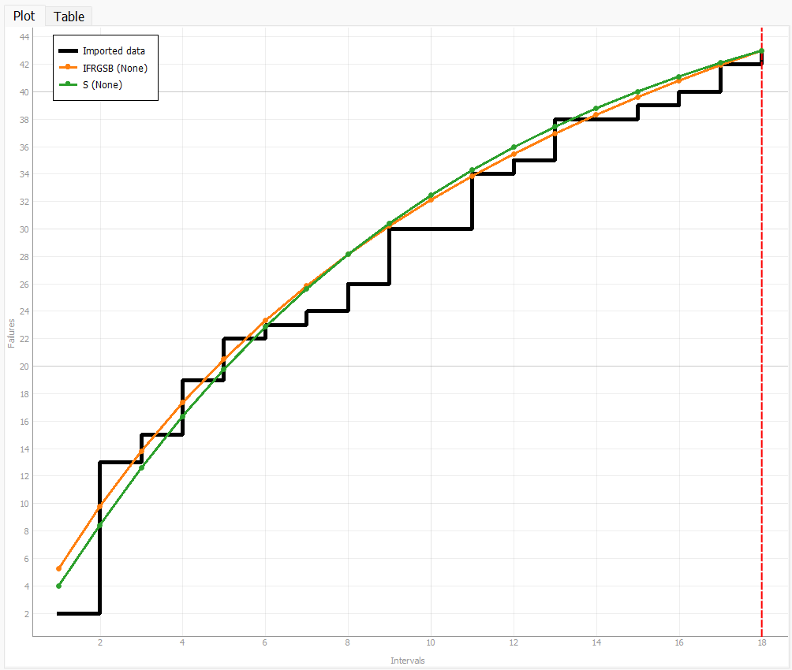
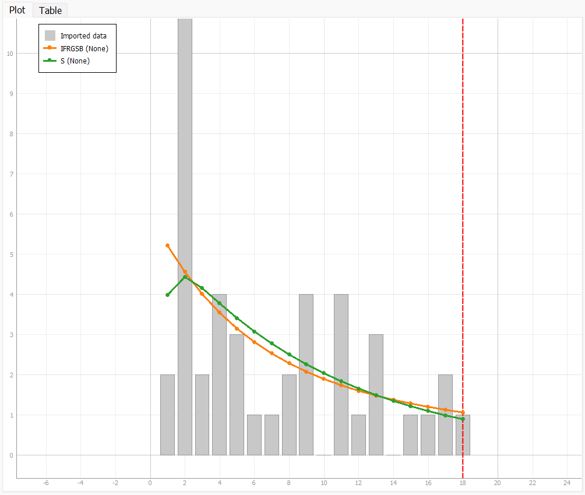
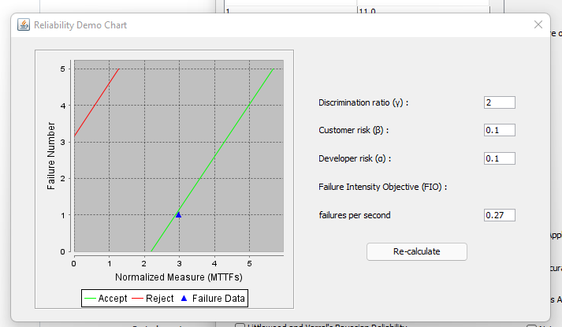
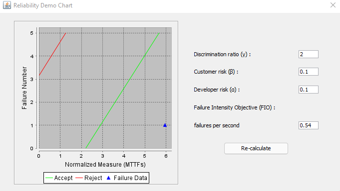
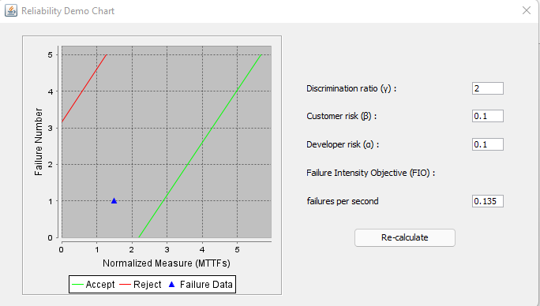

**SENG 438- Software Testing, Reliability, and Quality**

**Lab. Report \#5 – Software Reliability Assessment**

| Group \#:       | 10 |
|-----------------|---|
| Student Names:  | Rahat Islam |
|                 | Redwanul Islam  |
|                 |  Zeeshan Chougle |
|                 |  Mohammad Mahtab Khan |

# Introduction
The focus of this lab is for students to familiarize themselves with various concepts and tools required for the analysis of integration test data using reliability assessment tools. Reliability Growth Testing and Reliability assessment using Reliability Demonstration Chart (RDC) will be used.
# 

# Assessment Using Reliability Growth Testing 
## Result of Model Comparison

Using the C-SFRAT tool we, compared all the models provided. Since that alone was about 15 different models, we chose to choose no covariates. We just passed in the time intervals and the associated number of failures as input. Upon running the analysis on the tool, we chose the model with the great number for log likelihood which in other words meant how well the models were representing the data. As seen from the table below, Our top two models were the S and IFRGSB models. Note that we chose to use a subset of the data from time 1 - 18 when we made models. The rationale will be given in the next section.
### Model Comparison

### MVF Graph

### Failure Intensity Graph

### Additional Notes
the C-SFRAT tool does not provide a reliability graph, and since we were told that this tool was a viable option for part 1, we hope that we won't be docked for not being able to provide a graph that cannot be created with a tool we were explicitly told to use.

## Result of Range Analysis

To choose the best range, we wanted to test a single version fully. In other words, if a program had a big update in the middle, the data would get skewed and come more difficult to model. at time 19, we can see that there was a big spike in failures. Our assumption was that this was a feature update of the program done in the middle. that is why we thought the two best ranges to test would be 19-31 and 1-18. 19-31 would be the best range as it is the most recent, but since C-SFRAT can only alter the upper bound of the range (the lower bound must be at 1) we chose to model the range 1-18. From the diagrams above, we can see some consistent failure curves that accurately follow the trend of the failure data provided

## How Decision Making is Affected Given a Target Failure Rate

After modelling failure data, you must check that the overall failure rate from the created models. We cannot provide this number as the tool does does not provide an overall failure rate. Next you must compare it to the given target failure rate. If the actual failure rate is below the target failure rate, then the program can be accepted into production. However, if the failure rate is above the target failure rate, then changes much be made to the program to mitigate failures before it can be delivered to the clients as a finished product.

## Advantages and Disadvantages of Reliability Growth Analysis (RGA)

The advantage of Reliability Growth Analysis is that it provides alot of metrics that can be analyzed from the failure data. For instance you can get insights of the MTTF, failure intensity and even the reliability of your program at any specified time through the use of (RGA).

The drawback of using RGA however is that it is very in depth and takes some work to understand what the results even mean. In depth knowledge of RGA and how it works is required before using this methodology.

# Assessment Using Reliability Demonstration Chart 

### MTTFmin

### Twice MTTFmin

### Half MTTFmin

In order to determine the MTTFmin, we tested the failure data that we used with various MTTF values until we generated a plot where the last failure data just about crosses into the acceptable plot range. This is how we determined MTTFmin.

| Advantages of RDC Analysis      | Disadvantages of RDC Analysis |
|---------------------------------|-------------------------------|
| Versatile | Only demonstrates the trend of changes and how they effect reliability|
| Time efficient | Only indicates if SUT is acceptable or not |
| Cost efficient | Experimenting with different confidence levels and MTTF is tedious|
| Can be used to justify/support decisions |  
# 

# Comparison of Results

From the RDC method we were able to see that the program would be acceptable as long as the failure rate is below 0.27 failures per second. From the Reliability Growth Analysis tool we are able to see the trend in the failure rate and reliability over time. Further analysis would have to be done with this tool to find the MTTF, but with the models created, it wouldn't be much more work to find this information. Then it could be compared to the benchmarks as provided by the requirements.

# Discussion on Similarity and Differences of the Two Techniques
Reliability Growth Testing is based on inter failure times and/or failure count and target failure rate (or MTTF). However, Reliability Demonstration Chart is based on inter failure times only and target failure rate (or MTTF). Both techniques are similar in the sense that, they are both very important techniques for the analysis of integration test data.

# How the team work/effort was divided and managed
We split the work evenly across each person. We each spent time trying to understand what was required of us for this lab assignment, we then came to together shared our understanding of the requirements. We then all worked together on the same machine in order to complete the assignment and record the results.

# 

# Difficulties encountered, challenges overcome, and lessons learned
We faced quite a bit of difficulty, trying to figure out what to actually do for this lab as the instructions were very vague according to our understanding. To overcome this, we spoke to our TAs. In hindsight, it probably would've been a better idea if we contact our TAs a lot sooner.

# Comments/feedback on the lab itself
Overall the assignment taught us some very important skills. We would've really appreciated it if the instructions for this lab were a lot more clearer. Moreover, the tools used for this lab were quite buggy and not compatible with all popular operating systems.

